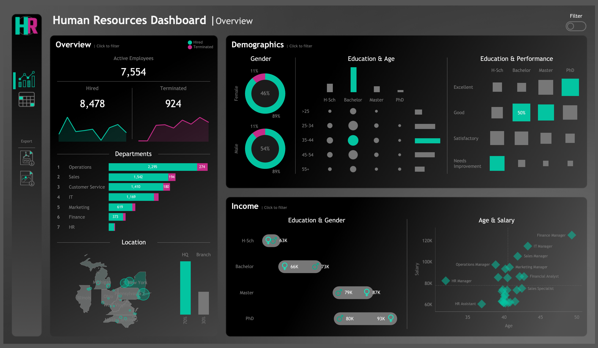
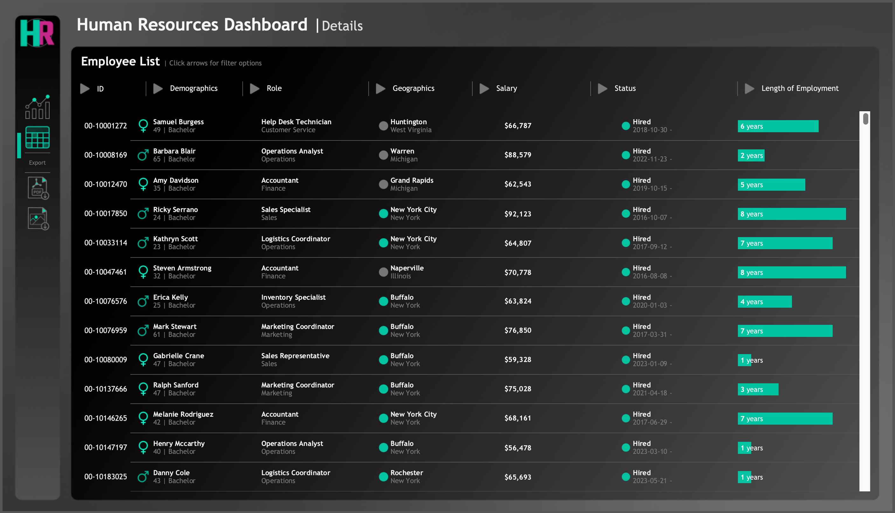

# People Analytics Tableau Project


Credits: [iStock/GettyImages](https://www.istockphoto.com/photo/businessman-touching-to-virtual-screen-with-infographic-and-hr-wording-human-gm1325421270-410453777)

<a href="https://www.tableau.com/">  </a> 
<a href="https://www.python.org/">  </a> 
<a href="https://pandas.pydata.org/">  </a> 
<a href="https://numpy.org/">  </a>
<a href="https://www.tableau.com/solutions/business-intelligence">  </a>
<a href="https://www.tableau.com/products/data-visualization">  </a>
<a href="https://www.analyticsvidhya.com/blog/2020/06/what-is-data-analytics-a-beginners-guide/">  </a>

## Overview

This project provides a comprehensive Tableau dashboard designed for HR managers. It aims to analyze human resources data, offering both summary views for high-level insights and detailed employee records for in-depth analysis.

## Benefits of Using Tableau


Credits: [Tableau](www.tableau.com)

- **Data Visualization**: Tableau transforms complex data into interactive, visual formats, making it easier to understand and analyze HR metrics.
- **Real-Time Analysis**: Users can access real-time data updates, allowing for immediate insights and faster decision-making.
- **User-Friendly Interface**: Tableau’s drag-and-drop functionality enables users with varying technical skills to create and modify dashboards effortlessly.
- **Integration Capabilities**: Tableau seamlessly integrates with various data sources, ensuring that HR managers can work with their existing systems.
- **Collaboration Features**: Tableau promotes collaboration by allowing users to share dashboards and insights across teams and departments.

## Importance of HR Analytics

- **Data-Driven Decisions**: HR analytics helps organizations make informed decisions based on data rather than intuition, leading to better outcomes.
- **Performance Tracking**: By analyzing employee performance metrics, organizations can identify high performers, areas for improvement, and tailor development programs accordingly.
- **Talent Management**: HR analytics provides insights into workforce demographics and turnover rates, helping organizations strategize their talent acquisition and retention efforts.
- **Workforce Planning**: Understanding employee data allows HR managers to forecast future hiring needs and develop strategies to meet organizational goals.
- **Enhanced Employee Engagement**: Analytics can reveal factors affecting employee satisfaction and engagement, enabling organizations to implement changes that improve the workplace culture.


## Problem Statement

The HR manager wants a comprehensive dashboard to analyze human resources data, providing both summary views for high-level insights and detailed employee records for in-depth analysis.

## Summary View

The summary view is divided into three main sections:

### 1. Overview

This section provides a snapshot of overall HR metrics, including:
- Total number of hired employees, active employees, and terminated employees.
- Visualization of the total number of hired and terminated employees over the years.
- Breakdown of total employees by department and job titles.
- Comparison of total employees between headquarters (HQ) and branches (with New York as the HQ).
- Distribution of employees by city and state.

### 2. Demographics

The Demographics section offers insights into the composition of the workforce, including:
- Gender ratio in the company.
- Visualization of employee distribution across age groups and education levels.
- Total number of employees within each age group and education level.
- Correlation between employees' educational backgrounds and their performance ratings.

### 3. Income Analysis

This section focuses on salary-related metrics, including:
- Comparison of salaries across different education levels for both genders to identify discrepancies or patterns.
- Correlation of age with salary for employees in each department.

## Employee Records View

- A comprehensive list of all employees with essential information such as name, department, position, gender, age, education, and salary.
- Users can filter the list based on any of the available columns.

## Data Generation

A Python script is included to generate a realistic dataset of 8,950 records for human resources. The dataset includes the following attributes:

- **Employee ID**: A unique identifier.
- **First Name**: Randomly generated.
- **Last Name**: Randomly generated.
- **Gender**: Randomly assigned (46% Female, 54% Male).
- **State and City**: Randomly assigned from a predefined list.
- **Hire Date**: Randomly generated with custom probabilities for each year from 2015 to 2024.
- **Department**: Randomly chosen from a list with specified probabilities.
- **Job Title**: Randomly selected based on department.
- **Education Level**: Based on job title.
- **Performance Rating**: Randomly selected from specified ratings.
- **Overtime**: Randomly assigned (30% Yes, 70% No).
- **Salary**: Generated based on department and job title.
- **Birth Date**: Generated based on age group distribution.
- **Termination Date**: Assigned to a subset of employees.
- **Adjusted Salary**: Calculated based on gender, education level, and age.

## Python Script

A sample Python script is provided to demonstrate the data generation process. The script uses libraries such as `pandas`, `numpy`, and `Faker` to create the dataset.

### Example Script

```python
import pandas as pd
import numpy as np
from faker import Faker
from datetime import datetime, timedelta
import random

# Initialize Faker
fake = Faker('en_US')
Faker.seed(42)
np.random.seed(42)
random.seed(42)

# Configuration
num_records = 8950

# States & Cities
states_cities = {
    'New York': ['New York City', 'Buffalo', 'Rochester'],
    'Virginia': ['Virginia Beach', 'Norfolk', 'Richmond'],
    'Florida': ['Miami', 'Orlando', 'Tampa'],
    'Illinois': ['Chicago', 'Aurora', 'Naperville'],
    'Pennsylvania': ['Philadelphia', 'Pittsburgh', 'Allentown'],
    'Ohio': ['Columbus', 'Cleveland', 'Cincinnati'],
    'North Carolina': ['Charlotte', 'Raleigh', 'Greensboro'],
    'Michigan': ['Detroit', 'Grand Rapids', 'Warren']
}
states = list(states_cities.keys())
state_prob = [0.7, 0.02, 0.01, 0.03, 0.05, 0.03, 0.05, 0.11]
assigned_states = np.random.choice(states, size=num_records, p=state_prob)
assigned_cities = [np.random.choice(states_cities[state]) for state in assigned_states]

# Departments & Jobtitles
departments = ['HR', 'IT', 'Sales', 'Marketing', 'Finance', 'Operations', 'Customer Service']
departments_prob = [0.02, 0.15, 0.21, 0.08, 0.05, 0.30, 0.19]
jobtitles = {
    'HR': ['HR Manager', 'HR Coordinator', 'Recruiter', 'HR Assistant'],
    'IT': ['IT Manager', 'Software Developer', 'System Administrator', 'IT Support Specialist'],
    'Sales': ['Sales Manager', 'Sales Consultant', 'Sales Specialist', 'Sales Representative'],
    'Marketing': ['Marketing Manager', 'SEO Specialist', 'Content Creator', 'Marketing Coordinator'],
    'Finance': ['Finance Manager', 'Accountant', 'Financial Analyst', 'Accounts Payable Specialist'],
    'Operations': ['Operations Manager', 'Operations Analyst', 'Logistics Coordinator', 'Inventory Specialist'],
    'Customer Service': ['Customer Service Manager', 'Customer Service Representative', 'Support Specialist', 'Help Desk Technician']
}
jobtitles_prob = {
    'HR': [0.03, 0.3, 0.47, 0.2],  # HR Manager, HR Coordinator, Recruiter, HR Assistant
    'IT': [0.02, 0.47, 0.2, 0.31],  # IT Manager, Software Developer, System Administrator, IT Support Specialist
    'Sales': [0.03, 0.25, 0.32, 0.4],  # Sales Manager, Sales Consultant, Sales Specialist, Sales Representative
    'Marketing': [0.04, 0.25, 0.41, 0.3],  # Marketing Manager, SEO Specialist, Content Creator, Marketing Coordinator
    'Finance': [0.03, 0.37, 0.4, 0.2],  # Finance Manager, Accountant, Financial Analyst, Accounts Payable Specialist
    'Operations': [0.02, 0.2, 0.4, 0.38],  # Operations Manager, Operations Analyst, Logistics Coordinator, Inventory Specialist
    'Customer Service': [0.04, 0.3, 0.38, 0.28]  # Customer Service Manager, Customer Service Representative, Support Specialist, Help Desk Technician
}

# Educations
educations = ['High School', "Bachelor", "Master", 'PhD']

education_mapping = {
    'HR Manager': ["Master", "PhD"],
    'HR Coordinator': ["Bachelor", "Master"],
    'Recruiter': ["High School", "Bachelor"],
    'HR Assistant': ["High School", "Bachelor"],
    'IT Manager': ["PhD", "Master"],
    'Software Developer': ["Bachelor", "Master"],
    'System Administrator': ["Bachelor", "Master"],
    'IT Support Specialist': ["High School", "Bachelor"],
    'Sales Manager': ["Master","PhD"],
    'Sales Consultant': ["Bachelor", "Master", "PhD"],
    'Sales Specialist': ["Bachelor", "Master", "PhD"],
    'Sales Representative': ["Bachelor"],
    'Marketing Manager': ["Bachelor", "Master","PhD"],
    'SEO Specialist': ["High School", "Bachelor"],
    'Content Creator': ["High School", "Bachelor"],
    'Marketing Coordinator': ["Bachelor"],
    'Finance Manager': ["Master", "PhD"],
    'Accountant': ["Bachelor"],
    'Financial Analyst': ["Bachelor", "Master", "PhD"],
    'Accounts Payable Specialist': ["Bachelor"],
    'Operations Manager': ["Bachelor", "Master"],
    'Operations Analyst': ["Bachelor", "Master"],
    'Logistics Coordinator': ["Bachelor"],
    'Inventory Specialist': ["High School", "Bachelor"],
    'Customer Service Manager': ["Bachelor", "Master", "PhD"],
    'Customer Service Representative': ["High School", "Bachelor"],
    'Support Specialist': ["High School", "Bachelor"],
    'Customer Success Manager': ["Bachelor", "Master", "PhD"],
    'Help Desk Technician': ["High School", "Bachelor"]
}

# Hiring Date
# Define custom probability weights for each year
year_weights = {
    2015: 5,   # 15% probability
    2016: 8,   # 15% probability
    2017: 17,   # 20% probability
    2018: 9,  # 15% probability
    2019: 10,  # 10% probability
    2020: 11,  # 10% probability
    2021: 5,  # 8% probability
    2022: 12,  # 5% probability
    2023: 14,  # 2% probability
    2024: 9   # 2% probability
}


# Generate a random date based on custom probabilities
def generate_custom_date(year_weights):
    year = random.choices(list(year_weights.keys()), weights=list(year_weights.values()))[0]
    month = random.randint(1, 12)
    day = random.randint(1, 28)  # Assuming all months have 28 days for simplicity
    return fake.date_time_between(start_date=datetime(year, 1, 1), end_date=datetime(year, 12, 31))

def generate_salary(department, job_title):
    salary_dict = {
            'HR': {
                'HR Manager': np.random.randint(60000, 90000),
                'HR Coordinator': np.random.randint(50000, 60000),
                'Recruiter': np.random.randint(50000, 70000),
                'HR Assistant': np.random.randint(50000, 60000)
            },
            'IT': {
                'IT Manager': np.random.randint(80000, 120000),
                'Software Developer': np.random.randint(70000, 95000),
                'System Administrator': np.random.randint(60000, 90000),
                'IT Support Specialist': np.random.randint(50000, 60000)
            },
            'Sales': {
                'Sales Manager': np.random.randint(70000, 110000),
                'Sales Consultant': np.random.randint(60000, 90000),
                'Sales Specialist': np.random.randint(50000, 80000),
                'Sales Representative': np.random.randint(50000, 70000)
            },
            'Marketing': {
                'Marketing Manager': np.random.randint(70000, 100000),
                'SEO Specialist': np.random.randint(50000, 80000),
                'Content Creator': np.random.randint(50000, 60000),
                'Marketing Coordinator': np.random.randint(50000, 70000)
            },
            'Finance': {
                'Finance Manager': np.random.randint(80000, 120000),
                'Accountant': np.random.randint(50000, 80000),
                'Financial Analyst': np.random.randint(60000, 90000),
                'Accounts Payable Specialist': np.random.randint(50000, 60000)
            },
            'Operations': {
                'Operations Manager': np.random.randint(70000, 100000),
                'Operations Analyst': np.random.randint(50000, 80000),
                'Logistics Coordinator': np.random.randint(50000, 60000),
                'Inventory Specialist': np.random.randint(50000, 60000)
            },
            'Customer Service': {
                'Customer Service Manager': np.random.randint(60000, 90000),
                'Customer Service Representative': np.random.randint(50000, 60000),
                'Support Specialist': np.random.randint(50000, 60000),
                'Help Desk Technician': np.random.randint(50000, 80000)
            }
        }
    return salary_dict[department][job_title]

# Generate the dataset
data = []

for _ in range(num_records):
    employee_id = f"00-{random.randint(10000000, 99999999)}"
    first_name = fake.first_name()
    last_name = fake.last_name()
    gender = np.random.choice(['Female', 'Male'], p=[0.46, 0.54])
    state = np.random.choice(states, p=state_prob)
    city = np.random.choice(states_cities[state])
    hiredate = generate_custom_date(year_weights)
      #termdate
    department = np.random.choice(departments, p=departments_prob)
    job_title  = np.random.choice(jobtitles[department], p=jobtitles_prob[department])
    education_level = np.random.choice(education_mapping[job_title])
    performance_rating = np.random.choice(['Excellent', 'Good', 'Satisfactory', 'Needs Improvement'], p=[0.12, 0.5, 0.3, 0.08])
    overtime = np.random.choice(['Yes', 'No'], p=[0.3, 0.7])
    salary = generate_salary(department, job_title)

    data.append([
        employee_id,
        first_name,
        last_name,
        gender,
        state,
        city,
        hiredate,
        department,
        job_title,
        education_level,
        salary,
        performance_rating,
        overtime
    ])

## Create DataFrame
columns = [
     'employee_id',
     'first_name',
     'last_name',
     'gender',
     'state',
     'city',
     'hiredate',
     'department',
     'job_title',
     'education_level',
     'salary',
     'performance_rating',
     'overtime'
    ]


df = pd.DataFrame(data, columns=columns)

# Add Birthdate
def generate_birthdate(row):
    age_distribution = {
        'under_25': 0.11,
        '25_34': 0.25,
        '35_44': 0.31,
        '45_54': 0.24,
        'over_55': 0.09
    }
    age_groups = list(age_distribution.keys())
    age_probs = list(age_distribution.values())
    age_group = np.random.choice(age_groups, p=age_probs)

    if any('Manager' in title for title in row['job_title']):
        age = np.random.randint(30, 65)
    elif row['education_level'] == 'PhD':
        age = np.random.randint(27, 65)
    elif age_group == 'under_25':
         age = np.random.randint(20, 25)
    elif age_group == '25_34':
        age = np.random.randint(25, 35)
    elif age_group == '35_44':
        age = np.random.randint(35, 45)
    elif age_group == '45_54':
        age = np.random.randint(45, 55)
    else:
        age = np.random.randint(56, 65)

    birthdate = fake.date_of_birth(minimum_age=age, maximum_age=age)
    return birthdate

# Apply the function to generate birthdates
df['birthdate'] = df.apply(generate_birthdate, axis=1)

# Terminations
# Define termination distribution
year_weights = {
    2015: 5,
    2016: 7,
    2017: 10,
    2018: 12,
    2019: 9,
    2020: 10,
    2021: 20,
    2022: 10,
    2023: 7,
    2024: 10
}

# Calculate the total number of terminated employees
total_employees = num_records
termination_percentage = 0.112  # 11.2%
total_terminated = int(total_employees * termination_percentage)

# Generate termination dates based on distribution
termination_dates = []
for year, weight in year_weights.items():
    num_terminations = int(total_terminated * (weight / 100))
    termination_dates.extend([year] * num_terminations)

# Randomly shuffle the termination dates
random.shuffle(termination_dates)

# Assign termination dates to terminated employees
terminated_indices = df.index[:total_terminated]
for i, year in enumerate(termination_dates[:total_terminated]):
    df.at[terminated_indices[i], 'termdate'] = datetime(year, 1, 1) + timedelta(days=random.randint(0, 365))


# Assign None to termdate for employees who are not terminated
df['termdate'] = df['termdate'].where(df['termdate'].notnull(), None)

# Ensure termdate is at least 6 months after hiredat
df['termdate'] = df.apply(lambda row: row['hiredate'] + timedelta(days=180) if row['termdate'] and row['termdate'] < row['hiredate'] + timedelta(days=180) else row['termdate'], axis=1)

education_multiplier = {
    'High School': {'Male': 1.03, 'Female': 1.0},
    "Bachelor": {'Male': 1.115, 'Female': 1.0},
    "Master": {'Male': 1.0, 'Female': 1.07},
    'PhD': {'Male': 1.0, 'Female': 1.17}
}


# Function to calculate age from birthdate
def calculate_age(birthdate):
    today = pd.Timestamp('today')
    age = today.year - birthdate.year - ((today.month, today.day) < (birthdate.month, birthdate.day))
    return age

# Function to calculate the adjusted salary
def calculate_adjusted_salary(row):
    base_salary = row['salary']
    gender = row['gender']
    education = row['education_level']
    age = calculate_age(row['birthdate'])

    # Apply education multiplier
    multiplier = education_multiplier.get(education, {}).get(gender, 1.0)
    adjusted_salary = base_salary * multiplier

    # Apply age increment (between 0.1% and 0.3% per year of age)
    age_increment = 1 + np.random.uniform(0.001, 0.003) * age
    adjusted_salary *= age_increment

    # Ensure the adjusted salary is not lower than the base salary
    adjusted_salary = max(adjusted_salary, base_salary)

    # Round the adjusted salary to the nearest integer
    return round(adjusted_salary)

# Apply the function to the DataFrame
df['salary'] = df.apply(calculate_adjusted_salary, axis=1)

# Convert 'hiredate' and 'birthdate' to datetime
df['hiredate'] = pd.to_datetime(df['hiredate']).dt.date
df['birthdate'] = pd.to_datetime(df['birthdate']).dt.date
df['termdate'] = pd.to_datetime(df['termdate']).dt.date

print(df)

# Save to CSV
df.to_csv('HumanResources.csv', index=False)
```
## Steps in Tableau

1. **Data Collection**  
   Gathered relevant workforce data from various sources, ensuring it's accurate and complete.

2. **Loading Data**  
   Imported the collected data into Tableau using supported file formats (e.g., CSV, Excel, SQL databases).

3. **Creating Individual Sheets**  
   Developed separate worksheets for different metrics and analyses, allowing for focused visualization.

4. **Item and Value Hierarchy**  
   Established a hierarchy for dimensions (e.g., department, job title) to enable drill-down capabilities in your visualizations.

5. **Calculations**  
   Created calculated fields to derive new metrics or insights from existing data, enhancing the analysis.

6. **Adding All Sheets into Dashboard**  
   Combine the individual sheets into a cohesive dashboard, allowing for a comprehensive view of the data.

7. **Editing Color and Tooltips**  
   Customized colors and tooltips for clarity and better user experience, ensuring the dashboard is visually appealing.

8. **Final Touches**  
   Made necessary adjustments to layout, labels, and interactivity, ensuring the dashboard is user-friendly and insightful.

## Demo: 



## Demo Gif: 


## Demo Video: 


## Conclusion

By utilizing the comprehensive dashboard, organizations can gain a deeper understanding of their human resources. The insights derived from Tableau empower HR managers to enhance recruitment strategies, optimize workforce planning, and improve employee engagement, ultimately leading to better overall management strategies. Embracing Tableau in people analytics not only elevates HR functions but also drives organizational success through informed decision-making.
